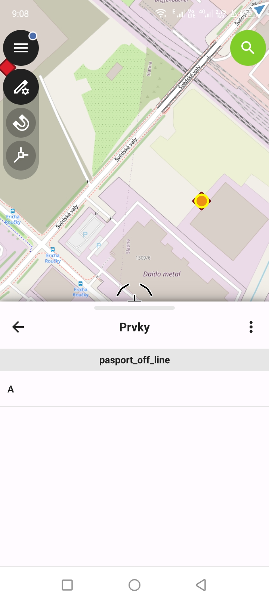
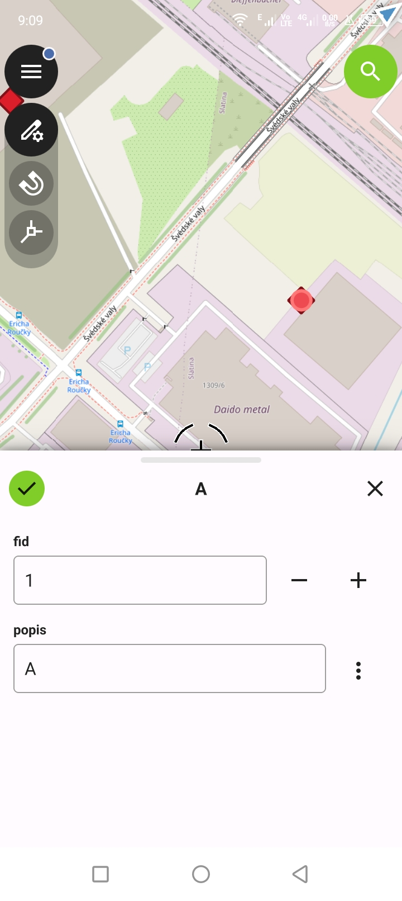
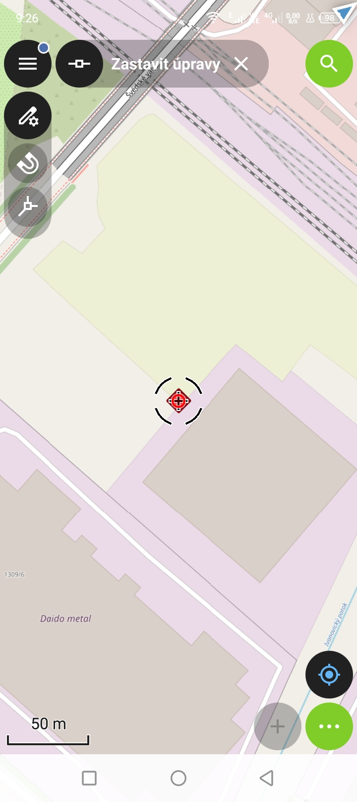
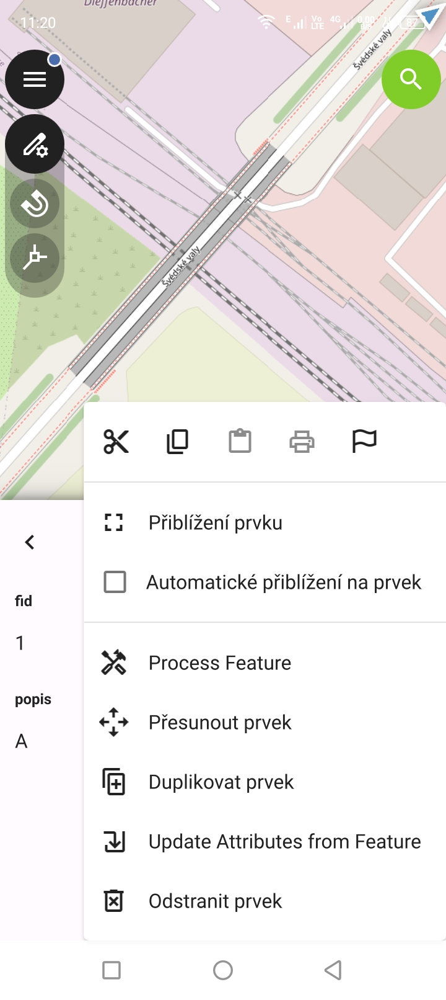

# Editace

Editace v QField je možná pomocí editace atributů existujících geoprvků
editací geometrie existujících geoprvků nebo vytvářením nových geoprvků.
Geoprvky nebo hodnoty atributů je možné také mazat.

## Vytváření geoprvků

V případě bodové vrstvy je přidávání velmi pdobné jako přidávání
bodů měření. Posuneme mapu tak aby kurzor byl v místě kam chceme
umísti bod a zvolíme talčítko Plus.

{ class="img-small" }

/// caption
Umístění kurzoru.
///

Zobrazí se formulář s atributy geoprvku, které můžeme vyplnit.

{ class="img-small" }

/// caption
Vyplnění atributů.
///

Po potvrzení je bod umístěn do mapy a vykreslen symbolem
dle pravidel vrstvy.

{ class="img-small" }

/// caption
Vytvořený geoprvek.
///

## Editace geoprvků

K editaci geoprvků využijeme kliknutí (dotyk) na geoprvek, kurzor může být mimo něj.  

{ class="img-small" }

/// caption
Kurzor mimo geoprvek.
///

Po kliknutí na geoprvek se zobrazí seznam geoprvků s aktivním geoprvkem. 
Geoprvek je rovněž zvýrazněn jinou ikonou v mapě.

{ class="img-small" }

/// caption
Vybraný geoprvek.
///

Klikneme (dotkneme se) geoprvku v seznamu (na obrázku text "A"), 
čímž aktivujeme další funkce.

{ class="img-small" }

/// caption
Funkce pro editaci geoprvku.
///

Pro editaci atributů volíme ikonu A s tužkou.
Hodnoty můžeme přepsat a potvrdit zelenou potvrzovací ikonou.

{ class="img-small" }

/// caption
Editace atributů.
///

Pro editaci geometrie volíme ikonu geometrie s tužkou.
Po aktivaci se automaticky přepneme do režimu editace vertexů 
(bodů nebo lomových bodů geometrie).

{ class="img-small" }

/// caption
Editace geometrie.
///

Klikneme na vertex (bod). Ikona se změní na modré kolečko. Tímto je vertex vybrán.

{ class="img-small" }

/// caption
Vybraný bod.
///

Posuneme kurzor na místo, kam chceme bod umístit tak že posuneme mapu.
Posouvá se pouze kurzor s modrým kolečkem.

{ class="img-small" }

/// caption
Nové umístění bodu.
///

Umístění potvrdíme zelenou potvrzovací ikonou. Bod se přesune na nové místo.

{ class="img-small" }

/// caption
Potvrzení nového umístění bodu.
///

## Mazání geoprvků

Mazání prvků se realizuje přes formulář prvků, který jsme již viděli
v části editace.

K formuláři je možné se tedy dostat stejně jako v případě editace a to dotykem (kliknutím)
na prvek v mapě a následně výběrem prvku ze seznamu.

Druhá možnost je dlouhým stiskem na geoprvek v mapě.
V případě dlouhého stisku se aktivujě kontextová nápověda, která obsahuje
referenci na geoprvek a zobrazení formuláře.

{ class="img-small" }

/// caption
Kontextová nabídka.
///

Na formuláři v pravé části najdeme možnost zobrazení dalších funkcí. Jedna z nich
je Odstranit prvek.

{ class="img-small" }

/// caption
Funkce formuláře.
///

Odstranění prvku musíme potvrdit na následujícím dialogu.

{ class="img-small" }

/// caption
Potvrzení odstranění geoprvku.
///

## Topologická editace geoprvků

Podobně jako v QGIS Desktop je možné zapnout topologickou editaci.
