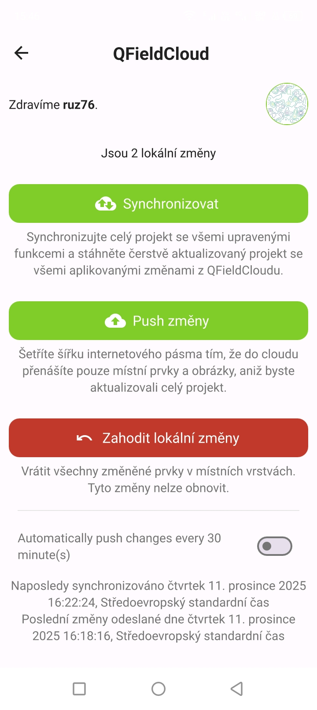
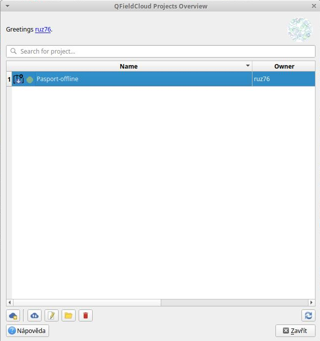

# Synchronizace

Synchronizace dat mezi desktop počítačem a mobilním telefonem je možná různými způsoby.
V případě QField se nabízí v zásadě čtyři možnosti:

* Využití služby QField Cloud a zásuvného modulu pro QGIS QField Sync
* Využití zásuvného modulu QField Sync bez využití služeb cloudu
* Ruční kopírování dat a automatická nebo poloautomatická synchronizace
* Využití PostgreSQL/PostGIS připojení

Velmi snadné je využití služby QField Cloud. V omezené podobě je k dispozici zdarma.

Ještě jednodušší je využití PostgreSQL/PostGIS připojení, protože k synchronizaci
dochází automaticky, bez nutnosti jakékoli činnosti ze strany uživatele. Toto řešení
však vyžaduje stabilní připojení k internetu. Je sice možné využít nějaké další nástroje
a toto omezení obejít, ale to již není tak triviální. 
Detailněji je tento způsob popsán dále. 

## Synchronizace dat na cloud

V případě, že jsme provedli nějaké změny na straně mobilní aplikace 
a máme projekt načten z QField Cloudu je synchronizace snadná. 

## Odeslání dat z QField na cloud

Zvolíme boční panel, který obsahuje ikonu cloudu, s informací o změnách.

<figure>

<figcaption>Boční panel</figcaption>
</figure>

Na následující obrazovce volíme buď kompletní synchronizaci (Synchronizovat) nebo
jen synchronizaci dat (Push změny).

<figure>

<figcaption>Boční panel</figcaption>
</figure>

V obou případech dojde k nahrání dat na cloud, ze kterého můžeme načít data v QGIS,
tak jak je popsáno dále.

## Instalace zásuvného modulu QGIS

Zásuvný modul se instaluje stejně jako jiné moduly z hlavního repozitáře QGIS.

<figure>

<figcaption>Instalace zásuvného modulu</figcaption>
</figure>

Nainstalovaný modul instaluje nástrojovou lištu, která slouží k sychronizaci jak přes cloud,
dat bez využití cloudu. Součástí lišty je i nastavení pro QField. 

<figure>

<figcaption>Nástrojová lišta modulu</figcaption>
</figure>

## Načtení dat v QGISu

K načtení dat z cloudu slouží první dvě tlačítka na liště. První použijeme v případě,
že zatím projekt na disku nemáme k dispozici. Druhé v případě, že již projekt máme k dispozici
a je aktuálně otevřen v QGIS.

Po zvolení prvního tlačítka a přihlášení se do cloudu se zobrazí seznam naši projektů.

<figure>

<figcaption>Seznam projektů na cloudu</figcaption>
</figure>

Po vybrání projektu ze seznamu již můžeme provést synchronizaci pomocí druhého tlačítka.

<figure>

<figcaption>Aktivovaný projekt</figcaption>
</figure>

V případě, že projekt nemáme k dispozici, vyzve nás zásovný modul k zadání cesty,
kam se má projekt uložit.

<figure>

<figcaption>Cesta k projektu</figcaption>
</figure>

Následně již můžeme provést synchronizaci dat. V našem případě je situace
jednoduchá, protože lokálně nemáme žádná data, proto převezmeme data z cloudu.

<figure>

<figcaption>Stažení dat z cloudu</figcaption>
</figure>

Pokud dojde ke stažení dat, objeví se potvrzení o stažení.

<figure>

<figcaption>Potvrzení stažení dat z cloudu</figcaption>
</figure>

Následně můžeme pomocí ikony Open otevřít stažený projekt.

<figure>

<figcaption>Otevřený stažený projekt</figcaption>
</figure>

## Úprava dat v QGISu

V případě, že provedem úpravy na straně QGIS, můžeme je nahrát na cloud.

<figure>

<figcaption>Nový geoprvek</figcaption>
</figure>

Změny nejdříve zapíšeme do souboru, nejlépe ukončením editace.
Pak zvolíme ikonu cloudu (druhou na liště zásuvného modulu).

<figure>

<figcaption>No action</figcaption>
</figure>

Implicitně je stav No action, tedy se neprovede, žádná operace.
V tomto případě chceme nahrát data z lokálního počítače na cloud.
Volíme proto možnost lokálního počítače, buď zaškrtávacím tlačítkem
pod ikonou desktopu vedle položky, kterou chceme synchronizovat nebo talčítkem 
Prefer Local (zapne všechny položky v seznamu jako local).

<figure>

<figcaption>Prefer Local</figcaption>
</figure>

Zvolíme možnost Perform Actions, která provede synchronizaci.

<figure>

<figcaption>Synchronizace dokončena</figcaption>
</figure>

Na mobilním telefonu zvolíme nejdříve boční panel.

<figure>

<figcaption>Boční panel QField</figcaption>
</figure>

V panelu vybere ikonu cloudu a na další obrazovce dáme Synchronizovat.

<figure>

<figcaption>Synchronizovat</figcaption>
</figure>

Data se stáhnou z cloudu a již je máme k dispozici v mapě. 
Vidíme nově přidaný bod.

<figure>

<figcaption>Aktualizovaná data</figcaption>
</figure>

## Synchronizace kopírováním souborů

TODO

## PostGIS

TODO

## Mergin Maps

TODO

## GIS Quick

TODO
