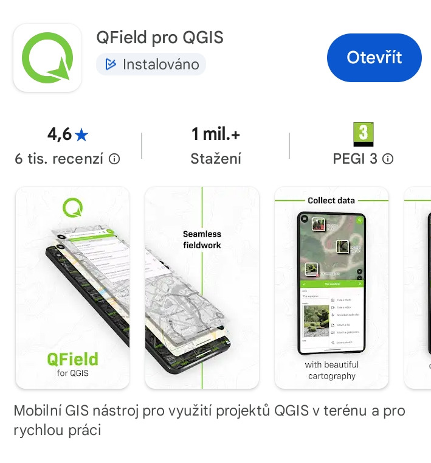

# Instalace

Instalace se sestává z několika kroků. V závislosti na povaze vaší práce
si můžete vystačit např. pouze s aplikací QField pro mobilní zařízení.
V případě, že budete i data synchronizovat na počítač (server) nebo
chystat projekty pro další uživatele musíte instalovat i QGIS a plugin 
pro synchronizaci.

## QField

- [Android](https://play.google.com/store/apps/details?id=ch.opengis.qfield){ target="_blank" }
- [iOS](https://apps.apple.com/app/qfield-for-qgis/id1531726814){ target="_blank" }
- dále lze nainstalovat i na systémy [Windows, Linux i MacOS](https://docs.qfield.org/getstarted/){ target="_blank" }

<figure>

<figcaption>Instalace na OS Android.</figcaption>
</figure>

## QGIS

Instalace systému QGIS je popsána v rámci 
materiálů pro školenní [QGIS pro začátečníky](https://gismentors.github.io/qgis-zacatecnik/instalace/index.html){ target="_blank" }.

## Pluginy pro synchronizaci

Instalace pluginů pro synchronizace je posána ve sekci Editace.
