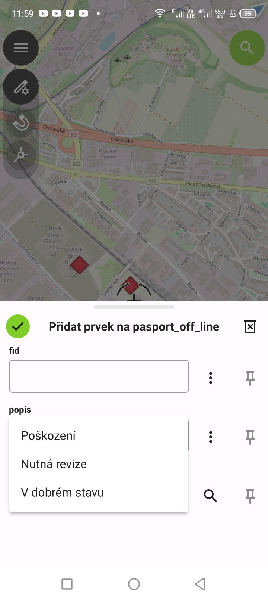
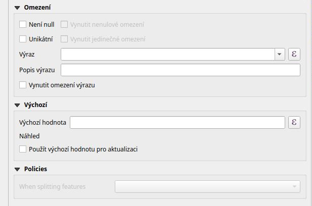

# Formuláře

## QGIS Projekt

Většina nastavení se přenáší jako součást projektu.
QFieldSync používá QGIS projekt ve formátu `.qgs`, což jednoduše soubor ve formátu XML. Ale lze použít i formát `.qgz`, 
což je pouze komprimovaný `.qgs`  soubor v archivu ZIP, což umožňuje mít u projektu i nějaké doporvodné soubory.
Symbologie a další nastavení vrstev je součástí QGIS projektu a přenáší se tak i do QField. 
Projekt se ukloží pomocí ikony diskety v hlavní nástrojové liště QGIS. Pokud chceme sdílet projekt s dalšími uživateli 
mimo cloud, je možné vytvořit z projektu a dat balíček pomocí QfieldSync zásuvného modulu, což připraví na jednom místě
 QGIS projekt včetně dat 

<!-- Pokud je váš projekt datově malý, pak se doporučuje umisťovat data 
a projekt do stejné složky nebo projekt od složky a data do podřízených složek. -->
<!-- 
Když pak chcete např. projekt předat někomu jinému stačí hlavní složky komprimovat 
a předat např. e-mailem.  -->

## GPKG formát

Formát GPKG je malou souborovou geodatabází. Může obsahovat více vrstvev geodat.
Jeho výhodou je, že se jedná o jeden soubor, který obsahuje jak data tak metadata.
Některá pravidla však mohou uživatelům komplikovat práci s tímto formátem.
Přesto, pokud k tomu není nějaký zásadní důvod, doporučujeme ho jako výchozí formát
pro ukládání dat v QGIS i v práci s QField. 

## Formuláře

Součástí projektu jsou formuláře, kde je možné pro každou vrstvu nastavit,
jak bude vypadat formulář pro editaci atributů. Např. můžete definovat, že se 
do některého pole mohou zapisovat pouze konkrétní hodnoty z výčtu.

Formuláře se dají konfigorovat přes nastavení vlastností vrstvy.

{ class="img-middle" }

/// caption
Vlastnosti vrstvy.
///

### Widgety

Pro nastavení jak má zadávání hodnot vypadat je možné specifikovat Widgety, 
což jsou malé kousky kódu s GUI, které zajišťují korektní vstupy.

Následující obrázek demonstruje, jak je možné pro pole typ, které je 
celé číslo specifikovat výčet hodnot, které je možné zadávat. 

{ class="img-middle" }

/// caption
Výčet hodnot.
///

Při vytváření nebo editaci atributů prvku se pak tento seznam hodnot 
zobrazuje místo čísla, ale do databáze se zapisuje číslo.

{ class="img-middle" }

/// caption
Výběr z výčtu hodnot.
///

Stejně se pak po synchronizaci projektu a dat chová QField.

{ class="img-small" }

/// caption
Výběr z výčtu hodnot v QField.
///

Oblíbeným Widgetem je Widget pro fotografie (resp. obecně přílohy).
QField ukládá fotografie s relativní cestou, proto aby se fotografie zorazoivali ve formuláři v QGIS,
je nutné nastavit cesty jako relativní k projektu.

Podrobně je problematika popsána v rámci školení 
[QGIS pro pokročilé](https://gismentors.github.io/qgis-pokrocily/pokrocile_upravy/index.html)

### Další pravidla pro pole

Mezi další pravidla pro pole, která se mohou nastavovat je např.: 

* Omezení, že hodnota musí být uvedena - Není null
* Unikátní hodnota - musí být vždy jedinečná hodnota v rámci vrstvy
* Výchozí hodnota - zapíše se jako výchozí, pokud uživatel nespecifikuje

{ class="img-middle" }

/// caption
Další pravidla pro pole.
///
